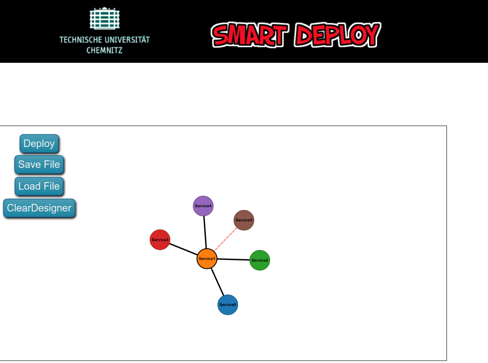

# Connect Sensors and Algorithms in a userfriendly way - Proof of Concept

We develop data fusion algorithms for intelligent vehicles. The data is being generated by sensors. Sensor interfaces and data fusion algorithms are implemented in software.

Each software component is able to connect and "talk" to other components via network (ethernet) interfaces. This assembly now provides the "application" functionality.

-----





# Problem

Currently we use a configuration file to describe which software components should connect to each other. The file describes for example, that component/sensor A should connect to component/algorithm B (see image above).
The configuration file also describes parameters for some components, for example that the component/sensor A (lets say a camera) should provide data with 100Hz.
Currently the configuration files is written manually.

```
//an example config file to connect sensor A to algorithm B; simplified
//this is how it is looking today and how we write the config files manually
//-----------------------

//Sensor A (a camera): Output port delivers RGB data
//Imageparameters Height and Width (for sensor configuration); FramesPerSecond = 100

[SensorA]
RGBStreamID = 0677074972345622127
ImageHeight = 480
ImageWidth = 640
FPS = 100

//-----------------------

//Algorithm B is expecting and processing an RGB image
//Input port is "RGBStreamID" from "SensorA"

[ImageAlgorithmB.RGBImage]
ImageStreamID = @SensorA.RGBStreamID
```

If we want to design a complex assembly/application the configuration file gets very complex and difficult to maintain.
It is also difficult to understand the assembly/application by just looking at the configuration file.

> At the end the solution (designer) should automatically generate the config file. This configfile is given to the executables to configure their behaviour.

# Solution
We need a user friendly way to

- create or describe the links between the software components
- configure the components
- control the deployments of the components
- visualize the assembly

-----

A good example what we are looking for is Node-RED (www.http://nodered.org/)

# Definition of Terms

- the software components can be sensors, algorithms or user interfaces, for example. Let's call them **nodes**
- a node can have multiple input and output **ports**
- a node can be configured
- a node usually is an executable, it runs localhost or remote
- multiple nodes can be connected by connecting the ports using a **link**
- the whole assembly is called **flow**
- let's call the result of the proof of concept the **designer**

# Tasks

You have already analysed Node-RED in the previous project. Use this knowledge to design proofs of concept for different components of the designer.

Find different solutions for the single tasks, if available. We will discuss the solutions and find the best one.

Evaluate different tools for the tasks, for example - but not limited to

- node.js (https://nodejs.org/en/)
- D3.js (https://d3js.org/)
- ...

-----

Implement **small, efficient and comprehensive** proof of concepts (components) for the following tasks.

Save them consecutively in dedicated folders in this repository.

> Overall goal is to keep the solution as comprehensive as possible and to keep the number of dependencies very low. (The user does not want to install multiple libaries etc. to run the designer)

## Run executable

Start executables at localhost and/or from remote using Javascript or similar technology.


## Create a workspace

Create a GUI workspace or dashboard (window) for designing the flow. Node-RED workspace is a good example.

## Node visualization

Visualize the node and its ports. For example Node-RED style (rectangles) or others. Do some experiments.
Style the nodes.

## Node dragging

Drag Nodes from the library to a workspace. Move nodes. Delete nodes.

## Node linking

Connect nodes using mouse action and create links between the nodes. Add and delete links.

- one port to one port
- one port to many ports
- many ports to one port

## Flow saving

Save the flow to a file (JSON or similar)

## Flow loading

Load a flow from file.

# Considerations

- What is needed to run the Designer?
- If we use D3.js - do we have to install a Webserver on each host?

--------

# Later...

## Port highlighting

Drag multiple nodes to the workspace. Hover over a port. Highlight similar ports at the other nodes.

**Purpose:**

Lets assume we have a camera sensor node and a radar sensor node. The camera node provides "image data" at his output port, the radar sensor provides "radar data". We have two other nodes available - image viewer and radar viewer.

If the researcher chooses the image sensor output port and wants to connect it to another node then the image viewer input node is supposed to get highlighted - since the image viewer would accept the image data.

This behaviour should make it easy to choose the right ports when connecting nodes to each other...

-----

- https://bl.ocks.org/mbostock/3087986
- https://stackoverflow.com/questions/11206015/clicking-a-node-in-d3-from-a-button-outside-the-svg/11211391#11211391

<!---
## Node configuration

Configure a node using a user dialogue (GUI).

## Node to library

Create nodes using a "node description file" (t.b.d. what that means exactly) and put them into a "library".

(Similar to the Node-RED left side of the GUI)
-->
